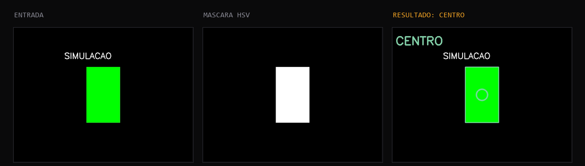

<div align="center">

# Detector de Posição por Cor

**Percepção visual de um sistema ciber-físico: da câmera à decisão.**

Um pipeline de visão computacional que detecta um objeto colorido numa imagem
e classifica sua posição, esquerda, centro ou direita, usando apenas
OpenCV e NumPy, sem aprendizado de máquina.

[](https://www.python.org)
[](https://opencv.org)
[](https://streamlit.io)

**Português** &nbsp;·&nbsp; [English](README.en.md)

</div>



---

## O problema

Antes de qualquer decisão automática, um sistema ciber-físico precisa perceber
o mundo. Este projeto resolve a etapa mais simples desse loop: dada uma
imagem, identificar onde um objeto está e traduzir isso numa decisão discreta.

> Entrada: uma imagem colorida. Saída: um comando entre **ESQUERDA**,
> **CENTRO**, **DIREITA** ou **SEM_DETECCAO**, baseado na posição horizontal
> do maior objeto da cor escolhida.

Esse loop, percepção e decisão, é a base de qualquer sistema ciber-físico
real: um carrinho que segue uma faixa, um braço robótico que localiza uma
peça, um drone que evita obstáculos. Aqui ele é resolvido do jeito mais
simples possível, limiarização de cor, antes de qualquer modelo mais
sofisticado entrar em cena nas próximas aulas.

---

## Como rodar

```bash
git clone https://github.com/caiogadotti/deteccao-cor-cv.git
cd deteccao-cor-cv
pip install -r requirements.txt
streamlit run app.py
```

O app abre em `http://localhost:8501`. Não precisa de dataset nem de
treinamento: o pipeline roda direto sobre a imagem que você enviar.

---

## O que o app faz

**Três formas de entrada, uma ativa por vez.** Tirar uma foto pela webcam do
navegador, enviar uma imagem do computador, ou gerar uma imagem sintética
quando não há câmera disponível. O mesmo problema que o professor resolveu
no script de demonstração, adaptado para dentro do app. Trocar de modo
desliga a câmera de verdade: só o widget do modo escolhido fica montado na
página, então a webcam não continua ativa escondida atrás de outra aba.

**Calibração ao vivo.** Quatro cores pré-configuradas (verde, azul, vermelho,
amarelo) ou um modo manual com sliders de matiz (H), saturação (S) e brilho
(V). A calibração em HSV é sensível à iluminação: é por isso que a aula pede
para testar em pelo menos duas condições de luz diferentes.

**Mostrar por quê.** O resultado não é só o rótulo: a imagem anotada mostra o
contorno e o centro detectados, e uma seção separada mostra a máscara binária
usada para chegar até ali. Dá para ver exatamente o que o algoritmo enxergou.

**Cobertura da cor-alvo.** Além da área do maior contorno, o app mostra que
fração da imagem inteira caiu dentro do intervalo de cor. Se essa cobertura
passar de 60%, aparece um aviso: é provável que o algoritmo esteja
detectando o fundo da cena, não um objeto isolado.

---

## O pipeline

Os mesmos cinco passos do notebook `aula01_camera.ipynb`, isolados em
`src/deteccao.py` como uma função pura, testável fora do Streamlit:

```
imagem BGR -> conversão para HSV -> limiarização (cv2.inRange)
           -> maior contorno (cv2.findContours) -> centro de massa (cv2.moments)
           -> classificação por posição horizontal
```

| Etapa | Função | Por que |
|---|---|---|
| BGR para HSV | `cv2.cvtColor` | Separar cor de brilho é mais fácil em HSV do que em RGB. A mesma cor sob luz forte ou fraca cai na mesma faixa de matiz |
| Limiarização | `cv2.inRange` | Cria uma máscara binária: branco onde o pixel está dentro do intervalo de cor |
| Contornos | `cv2.findContours` | Encontra as regiões conectadas de pixels brancos na máscara |
| Centro de massa | `cv2.moments` | Calcula o centroide do maior contorno, o ponto que representa "onde está o objeto" |
| Classificação | comparação com margem | Compara a posição horizontal do centro com o meio da imagem, usando uma faixa de tolerância para não oscilar entre CENTRO e ESQUERDA/DIREITA por 1 pixel |

**Por que uma margem em vez de comparar direto com o meio exato:** sem
tolerância, um objeto a 1 pixel do centro seria classificado ora como
ESQUERDA, ora como DIREITA, a cada pequena vibração da câmera ou do objeto.
A margem cria uma faixa estável de "CENTRO" no meio da imagem.

**Por que área mínima:** sem esse filtro, ruído na máscara (poucos pixels
isolados que caíram na faixa de cor por acaso) vira um "objeto" detectado.
Exigir uma área mínima descarta esse ruído.

---

## Estrutura do projeto

```
├── app.py                app Streamlit
├── src/
│   └── deteccao.py        pipeline de detecção, isolado e testável
├── requirements.txt
└── docs/
```

---

## Checklist de entrega (Aula 1)

- [x] A câmera abre sem erro (via `st.camera_input`, pelo navegador)
- [x] O quadro é exibido com o resultado sobreposto
- [x] Detecção funciona em mais de uma condição: a calibração manual (sliders
      de H/S/V) permite reajustar sem tocar no código quando a luz muda
- [x] A regra de decisão está implementada e comentada (`src/deteccao.py`)
- [x] Repositório com `README.md` e `requirements.txt`
- [x] Fallback sem câmera, para testar o pipeline sem depender de hardware

---

## Stack

| Biblioteca | Papel |
|---|---|
| **OpenCV** | Conversão de cor, limiarização, contornos, momentos |
| **NumPy** | Arrays de imagem e intervalos de cor |
| **Pillow** | Ponte entre o formato de imagem do Streamlit e o do OpenCV |
| **Streamlit** | Interface web |

---

## Créditos

**Disciplina:** Laboratório Computacional de Aprendizado de Máquina (LCML), 2026/2
**Turma:** CIB-NA8
**Professor:** Reinaldo Augusto de Oliveira Ramos
